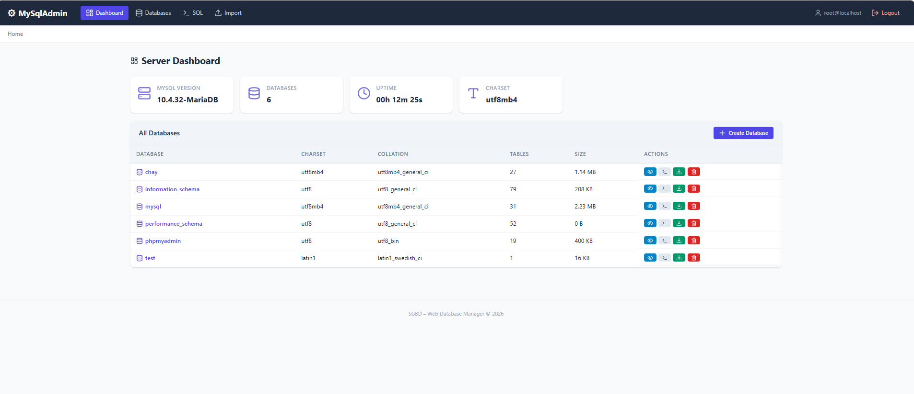

# MySqlAdmin – Web-Based Database Management System

A lightweight, modern web-based MySQL database manager built with PHP and PDO.  
Similar to phpMyAdmin, but with a clean, minimal interface.

## Screenshot



## Features

- **Authentication** – Login with MySQL credentials; session-based auth
- **Database Management** – Create, rename, drop databases
- **Table Management** – Create, drop, truncate tables; view structure
- **Column Management** – Add, edit (rename/retype), drop columns
- **Record Management** – Browse (paginated, sortable, searchable), insert, edit, delete rows
- **SQL Editor** – Execute arbitrary SQL with syntax shortcuts and Ctrl+Enter
- **Import** – Upload and execute `.sql` files (up to 50 MB)
- **Export** – Download databases/tables as `.sql` dumps
- **Security** – PDO prepared statements prevent SQL injection; HTML output escaped to prevent XSS
- **Responsive UI** – Modern CSS with Lucide icons; works on desktop and mobile

## Requirements

- PHP 7.4+ (with PDO and PDO_MySQL extensions)
- MySQL 5.7+ or MariaDB 10.3+
- Apache with `mod_rewrite` (XAMPP recommended)

## Installation

1. Clone or copy this folder into your web server root:
   ```
   c:\xampp\htdocs\MySqlAdmin\
   ```
2. Start Apache and MySQL from the XAMPP Control Panel.
3. Open your browser and navigate to:
   ```
   http://localhost/MySqlAdmin/
   ```
4. Log in with your MySQL credentials (default: `root` / empty password).
## Project Structure

```
MySqlAdmin/
├── index.php                    # Front controller / router
├── config/
│   └── database.php             # PDO connection class
├── helpers/
│   └── functions.php            # Utility functions (session, flash, escaping)
├── controllers/
│   ├── AuthController.php       # Login / logout
│   ├── DashboardController.php  # Server overview
│   ├── DatabaseController.php   # Database CRUD
│   ├── TableController.php      # Table operations
│   ├── ColumnController.php     # Column operations
│   ├── RecordController.php     # Record CRUD with pagination
│   ├── SqlController.php        # Custom SQL query editor
│   ├── ImportController.php     # SQL file import
│   └── ExportController.php     # SQL file export
├── views/
│   ├── layout/
│   │   ├── header.php           # Shared navigation & breadcrumbs
│   │   └── footer.php           # Shared footer & scripts
│   ├── auth/
│   │   └── login.php            # Login page
│   ├── dashboard.php            # Server dashboard
│   ├── database/
│   │   ├── list.php             # Database listing
│   │   └── create.php           # Create database form
│   ├── table/
│   │   ├── list.php             # Table listing
│   │   ├── create.php           # Create table form
│   │   └── structure.php        # Table structure view
│   ├── column/
│   │   ├── add.php              # Add column form
│   │   └── edit.php             # Edit column form
│   ├── record/
│   │   ├── browse.php           # Browse records (paginated)
│   │   ├── insert.php           # Insert record form
│   │   └── edit.php             # Edit record form
│   ├── sql/
│   │   └── editor.php           # SQL query editor
│   ├── import/
│   │   └── import.php           # Import SQL file
│   └── export/
│       └── export.php           # Export database/table
└── assets/
    ├── css/
    │   └── style.css            # Main stylesheet
    └── js/
        └── app.js               # Client-side interactions
```

## Security Notes

- All database queries use **PDO prepared statements** where user data is involved.
- All HTML output is escaped with `htmlspecialchars()` via the `h()` helper.
- Database names and table names are validated with regex (`[a-zA-Z0-9_]+`).
- Session credentials are stored server-side; no passwords in URLs or cookies.
- File imports are validated by extension and size.